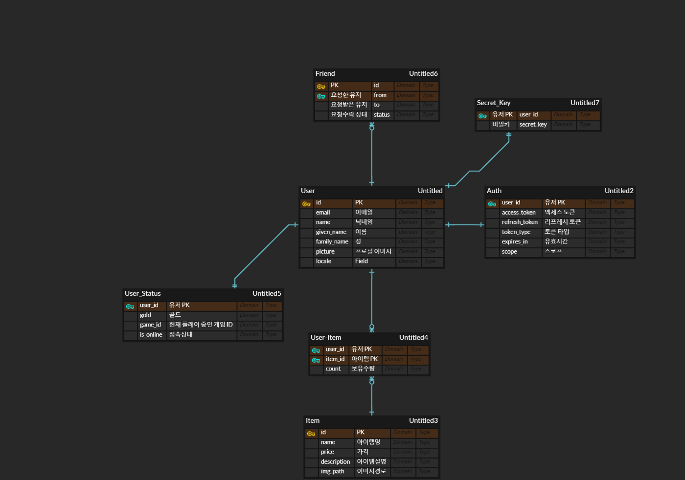
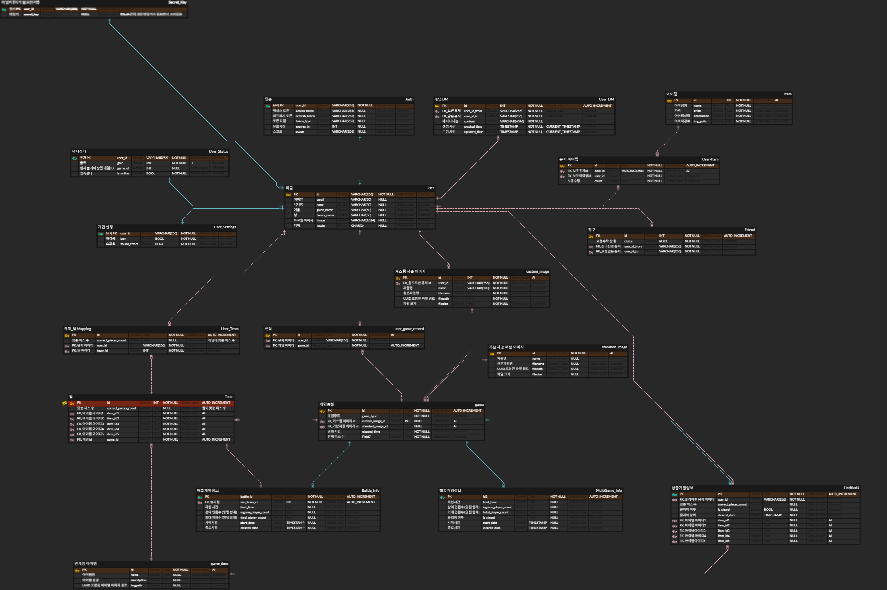

# 🗓️ 2024년 01월 15일 (월)
- 오전
  - 요구사항 명세서 작성
  - 데이터베이스 속성 정의
  - ERD 작성
- 오후
  - 화면설계, 요구사항 정의서, ERD 컨설팅
  - 데이터베이스 및 ERD 관계 재정립 (미완성)

# 🗓️ 2024년 01월 16일 (화)
- 오전
  - 데이터베이스 관계설정
  - ERD 작성 마무리
- 오후
  - Jira 스프린트 시작
  - Jira 이슈 (스토리, 작업) 등록
  - API 명세서 작성 (미완성)

  
  

# 🗓️ 2024년 01월 17일 (수)
- 오전
  - API 명세서 작성
  - Jira 이슈 (스토리, 작업) 등록
- 오후
  - 팀 전체 회의 (일정관련 공지)
  - 로컬PC 개발환경 설정
  - 백엔드 개발 컨벤션 설정
  