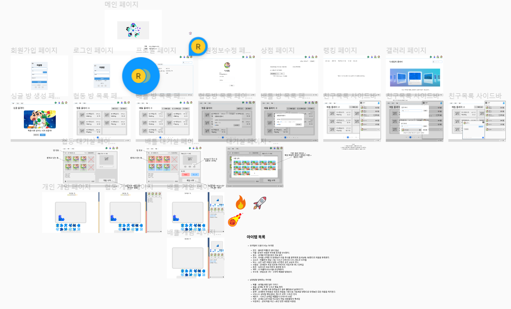
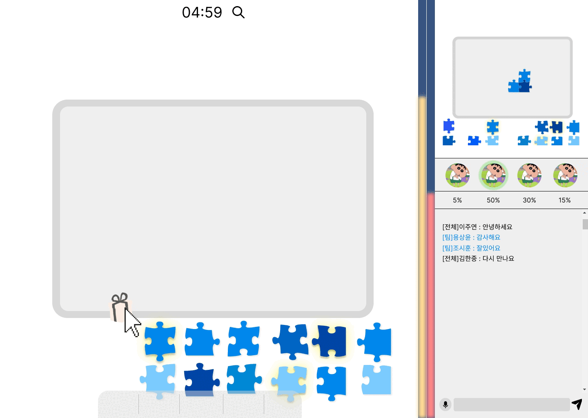

# 목차

- [🗓️ 1월 15일 (월)](#%EF%B8%8F-1월-15일-월)
- [🗓️ 1월 16일 (화)](#%EF%B8%8F-1월-16일-화)
- [🗓️ 1월 17일 (수)](#%EF%B8%8F-1월-17일-수)
- [🗓️ 1월 18일 (목)](#%EF%B8%8F-1월-18일-목)

 

# 🗓️ 1월 15일 (월)

- (주말동안) figma 보강 + gif
  
  

- 간단한 퍼즐 옮기기 로직 구현
  - #frontend_1/move_puzzle 브랜치 참고

# 🗓️ 1월 16일 (화)

- Jira 학습, 이슈 컨벤션 논의
- 1주차 스프린트에 이슈 등록
- branch 전략 논의
- canvas API를 이용하여 퍼즐 이동 로직 구현

# 🗓️ 1월 17일 (수)

- Jira 1주차 이슈 등록 마무리
- 코드리뷰 규칙 논의 및 결정
- Paper.js 학습
- 퍼즐 정답 판별 알고리즘 구상

# 🗓️ 1월 17일 (목)

- Paper.js 학습 2..
- Paper.js를 이용하여 피스 모양으로 자르는 기능 구현
  - 현재는 front에서 랜덤으로 피스모양(들어가고 나온 모양) 결정, 차후에 API 붙일때 해당함수 조정해야함
